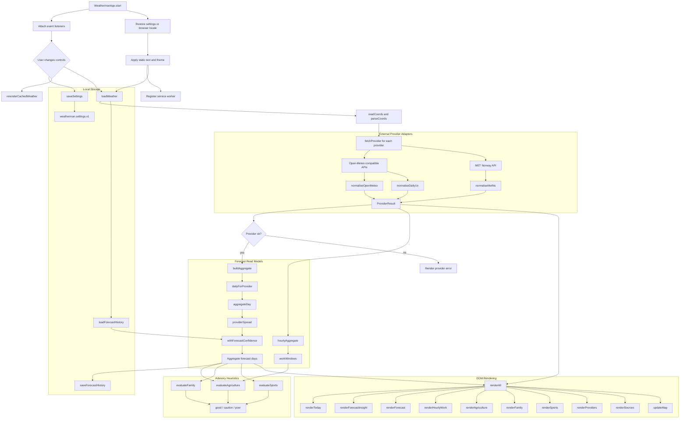

# App JavaScript Flow Chart

`src/app.js` is a dependency-free browser module that fetches multiple weather providers, converts them into one canonical forecast shape, builds median read models, applies advisory heuristics, and renders the static app.

## Main Boundaries

- Startup and preferences live in `start`, `loadSettings`, `saveSettings`, `applyStaticText`, and `applyTheme`.
- Provider adapters convert external API payloads into canonical `ForecastHour` rows before any aggregation happens.
- Forecast read models reduce provider data in two stages: provider-level daily summaries first, then cross-provider medians.
- Advisory heuristics are intentionally explainable rules that return score levels and translated reason keys.
- Rendering functions consume read models and advisory scores only; they do not fetch provider data directly.
- Forecast history is local-only and feeds confidence/change explanations, not provider fetching.
